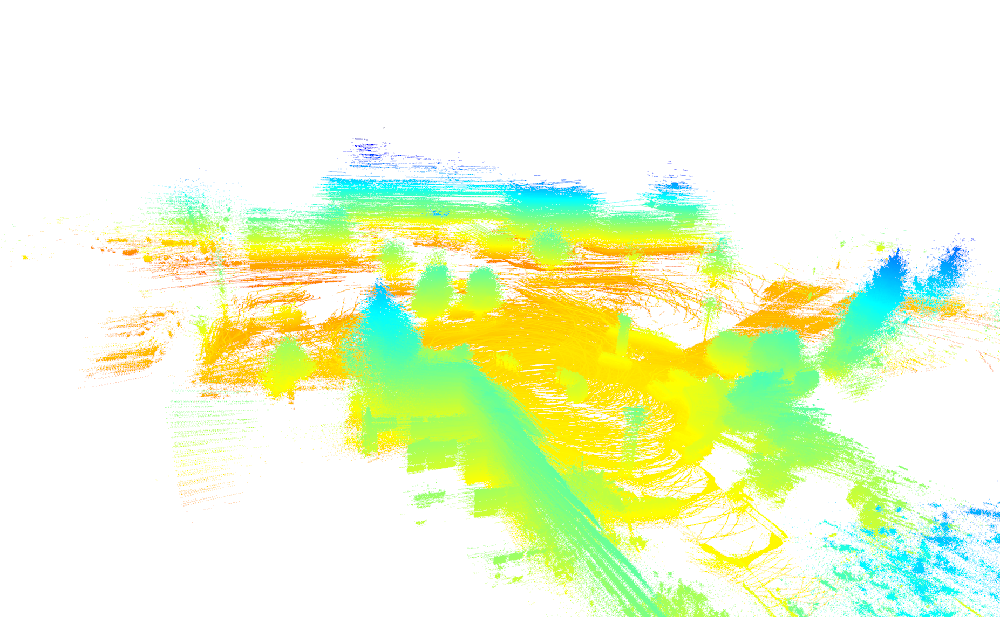
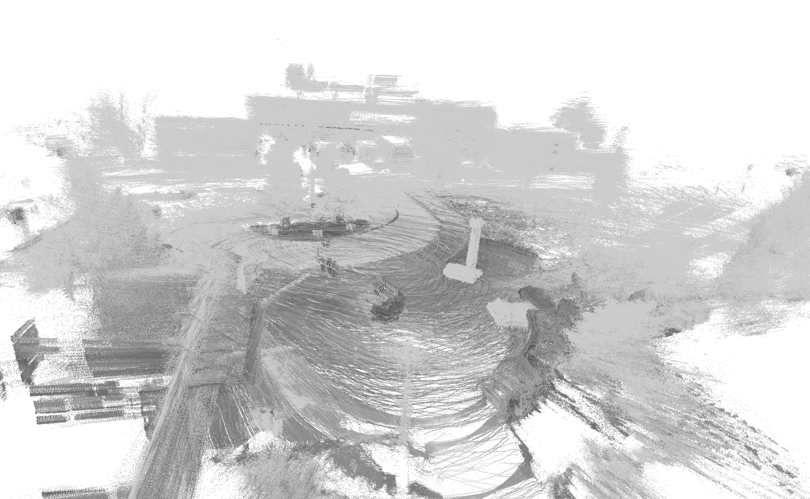

# ncltcloud

Python code to visualize accumulated NCLT point clouds.

To run the script, first install the required Python modules:

```bash
pip install numpy open3d-python pyquaternion transforms3d
```

Second, at the beginning of the script, set the `datadir` variable to the path of the folder that contains the NCLT data.
The folder `datadir` should contain at least `velodyne_data` and `ground_truth`.

Third, run the script.
The output should look like below.

Synchronized point cloud:


Raw points projected into robot frame:

